# InvaCogni: A Domain Invariant Multimodal and Multilingual Classifier for Mild Cognitive Impairment
<!-- table of contents-->
<details>
  <summary>Table of Contents</summary>
  <ol>
    <li><a href="#Introduction">Introduction</a></li>
    <li><a href="#Setup">Setup</a></li>
    <li><a href="#Dataset">Dataset</a></li>
    <li><a href="#Method">Method</a><ol>
      <li><a href="#Gradient-Reversal-Layer-(GRL)">Gradient Reversal Layer (GRL)</a></li>
      <li><a href="#Training">Training</a><ol>
        <li><a href="#Setting-1-InvaCogni-without-GRL">setting 1: The InvaCogni model without GRL</a></li>
        <li><a href="#Setting-2-InvaCogni-with-GRL-for-male-and-female-domains">setting 2: InvaCogni with GRL for male and female domains</a></li>
        <li><a href="#Setting-3-InvaCogni-with-GRL-for-English-and-Chinese-domains">Setting 3: InvaCogni with GRL for English and Chinese domains</a></li>
      </ol></li>
    </ol></li>
    <li><a href="#Results">Results</a></li>
    <li><a href="#References">References</a></li>
  </ol>
</details>

## Introduction:
- __In this project, I introduce a multimodal and multilingual classifier for classifying whether a person has MCI based on their ability to describe and recognize events which directly measure their cognitive ability. Additionally, I use a method which is called Gradient Reversal Layer (GRL) [3], to reduce the domain differences and by that, reduce the model performance gap on different domains (between male and female, English and Chinese).__
- __The base version of InvaCogni (without GRL) outperforms baseline models by over 1% on F1 score and by over 10% on Unweighted Average Recall (UAR). When GRL is applied, overall performance drops by about 4%, but the performance gap between male and female groups is reduced to only a 2% difference for UAR and a 0.6% difference for F1, and the model’s performance gap between English and Chinese speakers reduces to a 7.1% difference for the UAR score.__
- Mild Cognitive Impairment (MCI) is a condition in which the patient has noticeable declines in cognitive abilities, like memory, attention, or thinking skills, that are greater than expected for a person’s age but not severe enough to interfere significantly with daily life or independent function. People with MCI might notice that they forget things more often, have trouble finding words, or struggle with complex tasks, but they can generally still live independently [5]. They also have a high risk of developing dementia, which is the condition when a person has a loss of memory, language, problem-solving, and other thinking abilities that are severe enough to interfere with daily life [6]. Diagnosing whether a patient has MCI or not can be a crucial step to prevent it from developing into dementia, which currently has no cure and affects millions of people worldwide. To determine if someone has MCI or not, we can evaluate their cognitive ability; the idea here is that people with MCI will have a harder time describing, recognizing, and finding the word to describe the images and events.
- There has been some research on creating a classifier for this task using the Taukdial dataset from DementiaBank. One research developed a model called CogniVoice, which is a multimodal and multilingual network that uses Product of Experts (PoEs) to mitigate reliance on shortcut solutions (the easy-to-find patterns or spurious correlations in the training data). This model has the Unweighted Average Recall (UAR) score, which varies a lot across patients from different groups: 11.8% difference between male and female and 19.1% difference between English and Chinese [2]. This can indicate that the model is using domain-specific information (gender, accents, languages, etc.) when making predictions instead of the more general information that is related to the task and is very likely just a correlation and does not have any causal relationship with the MCI problem.

## Setup
```
conda create -n InvaCogni python=3.12.12
git clone https://github.com/wilnn/InvaCogni.git
conda activate InvaCogni
cd InvaCogni
pip install -r requirements.txt
```

## Dataset
The model is trained using the <a href="https://talkbank.org/dementia/TAUKADIAL/index.html">Taukdial</a> dataset from <a href="https://talkbank.org/dementia/">DementiaBank</a>, which contains speech data from 129 patients. Each patient is asked to describe 3 images, which create 387 speech samples in the dataset. In detail, it has:
1.	Audio files of the patients describing the images (1 minute per file on average)
2.	Sex: 39% are male and 61% are female. 57% of females have MCI, and 58% of males have MCI.
3.	Age: range from 61 to 87. The average age is 73.
4.	Mini-Mental State Examination (MMSE) score: MMSE is a questionnaire test that is used to assess cognitive functions like memory and attention. The higher the score, the better (max at 30). In the dataset, the score ranges from 13 to 30, with the average score being 27. This information is not used to train the model.
5.	Label: MCI vs NC (Normal Control). 57% of the samples have MCI.
6.	Language: English and Chinese. 52% are Chinese samples, and 48% are English samples. 49% of Chinese speakers have MCI, and 66% of English speakers have MCI.

Additionally, the authors of CogniVoice [2] collected 6 images and labeled the images that each patient describes. The image has an average size of 656x516. They also transcribed the audio file to text. There are 1509 unique words for English, with each English sample having an average of 142 words. For Chinese, there are 2533 unique words, with each sample having an average of 87 words.


## Method
### Gradient Reversal Layer (GRL)
Gradient Reversal Layer (GRL) is a technique introduced in [3] that can reduce the differences between domains by making the data representations output by the encoder for different domains become indistinguishable in terms of those domains. By using this, I can effectively reduce the domain differences in the data, which will reduce the performance gap between those domains.
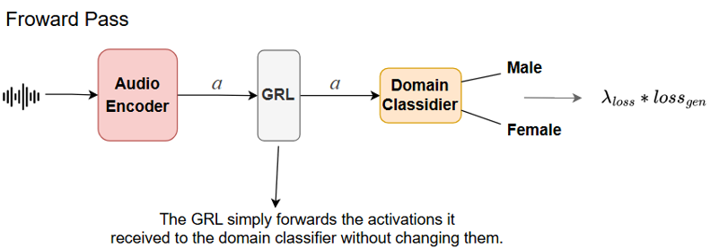
<br>Figure 1. showing how GRL works during the forward pass for male and female domains.
<br><br>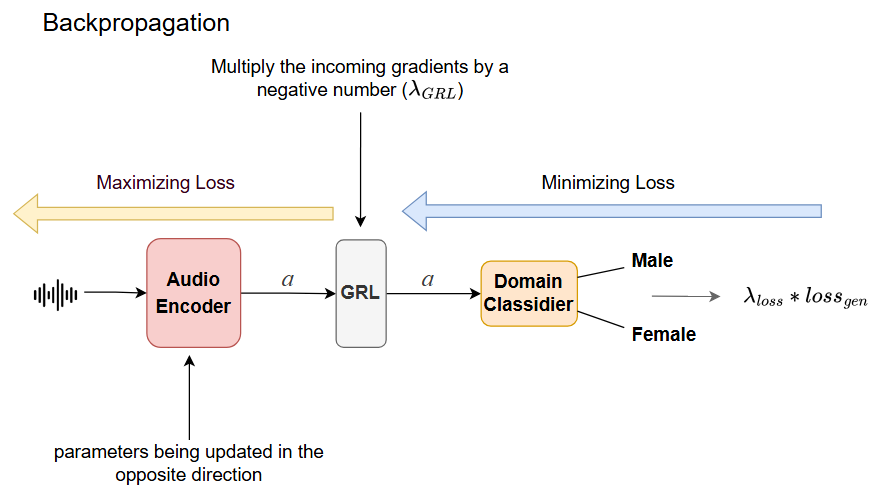
<br>Figure 2. showing how GRL works during the backward pass. The parameters in the domain classifier are trying to minimize the loss, while the parameters in the audio encoder are trying to maximize the loss due to the GRL.<br>
<br>In Figure 2, this setup creates a situation where the encoder and the domain classifier compete. The domain classifier is trying to update its parameters in a way that can help it tell which input is which domain (male or female), while the audio encoder will be based on that to update its parameters in the way that makes its output harder for the domain classifier to tell which input is which domain (meaning it tries to make the data representations output from the audio encoder to be viewed as the same in terms of the domains, which are male and female in this case).
<br>In figure 2, $$\lambda_{GRL}$$ is -1 for all cases, and $$\lambda_{loss}$$ is a number between 0 and 1 that will be adjusted during training based on this scheduler from [3]:
<br>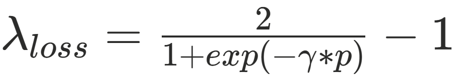        (1)
<br>Here, the $$\gamma$$ is a constant that controls how fast the $$\lambda_{loss}$$ will increase, and $$p$$ is the ratio of $$\frac {\text{the current training step}}{\text{total training steps}}$$ 
### Training:
#### Setting 1: InvaCogni without GRL
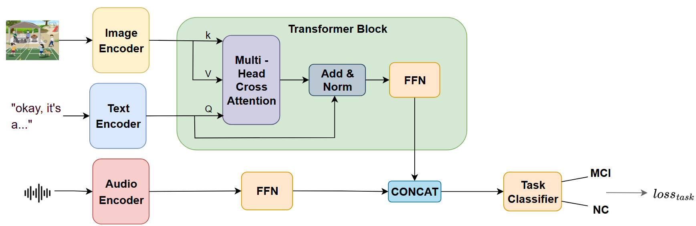
<br>Figure 3. The architecture of the InvaCogni model with no GRL.<br><br>


I use the image encoder of __siglip-base__ [7] as the image encoder of this model. For the text encoder, I use the __BERT-base-multilingual__ model [4], and for the audio encoder, I use the encoder part of the __whisper-base__ model [1]. The embeddings from the image encoder and text encoder are fused using cross attention. The idea here is that, given the patients’ text description of the image, the model should learn to match/compare the text description with the corresponding image. Then, the output from the transformer block is concatenated with features extracted from the audio embeddings and passed to the task classifier to give the prediction.
<br><br>The text encoder and image encoder is frozen during training.<br><br>


__Train the model for this setting by running:__
```
./linux_run_train_no_dc.sh
```

#### Setting 2: InvaCogni with GRL for male and female domains
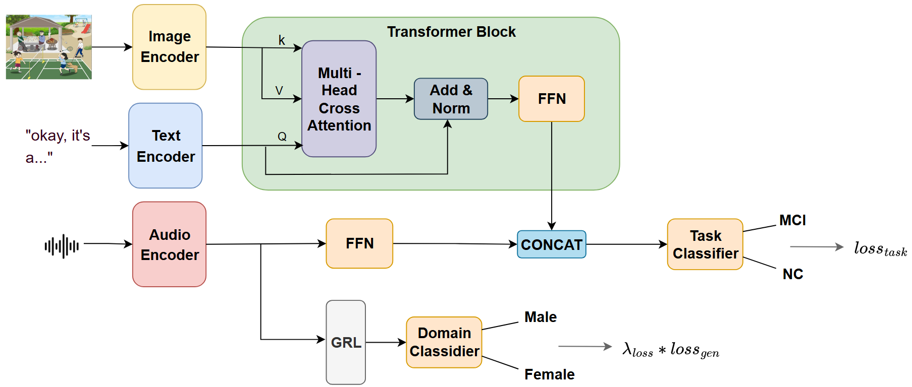
<br>Figure 4. The architecture of InvaCogni when using GRL to make male and female audio embeddings become domain invariant.
<br><br>I use the same model architecture as in setting 1 but also have GRL for male and female domains. All the hyperparameters is kept the same except that the number of epochs is 20 instead of 12 as in setting 1 because the audio encoder receives the gradients from 2 separate paths for 2 different training goals, which means it requires longer training time for the model to learn and adapt properly. Also, the loss is calculated by:<br>
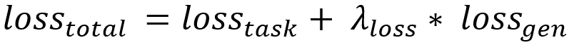

With $\gamma$ for the equation (1) set to 2, which gives the best result during experiments.<br><br>

__Train the model for this setting by running:__
```
./linux_run_train_dc_gen.sh
```

#### Setting 3: InvaCogni with GRL for English and Chinese domains
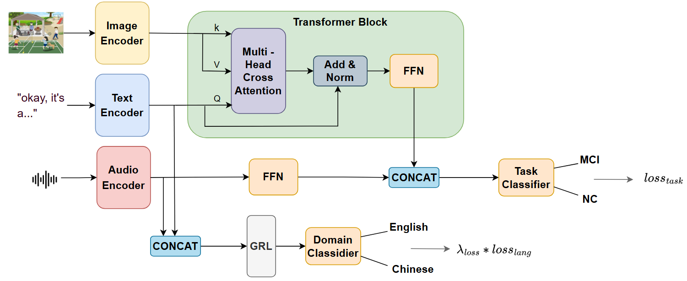
Figure 5. The architecture of InvaCogni when using GRL to make English and Chinese audio and text embeddings become domain invariant. The text and audio embeddings from the encoder is concatenated before being passed through GRL and the domain classifier.
<br>Similar to setting 2, but this time, the text encoder and audio encoder are not frozen. I do 50 epochs, and the loss is calculated by:
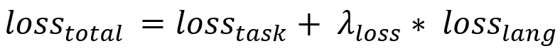

With $\gamma$ for the equation (1) set to 5, which gives the best result during experiments.<br><br>

__Train the model for this setting by running:__
```
./linux_run_train_dc_lang.sh
```

## Results
InvaCogni is evaluated and compared with the baseline models from CogniVoice using stratified k-fold cross validation (10 folds) with the average Unweighted Average Recall (UAR) and F1 score across folds. Additionally, to evaluate whether the GRL has successfully made the data representation from different groups become domain invariant, I use t-SNE to plot the audio data representations before and after training to compare.<br>
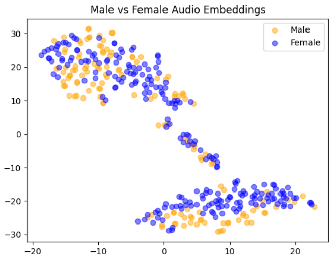
<br>Figure 6. The audio embeddings for male and female plotted using t-SNE before any training. Here, the male and female embeddings are nicely mixed, which is expected since the Whisper encoder that I use is trained for multilingual speech-to-text transcription, which does not distinguish whether the speaker is male or female.

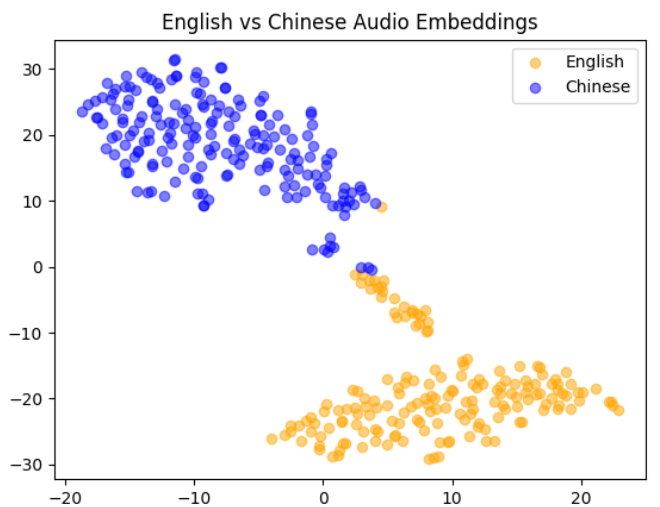
Figure 7. The audio embeddings that are produced by the audio encoder for English and Chinese speakers before any training.<br><br>

<br>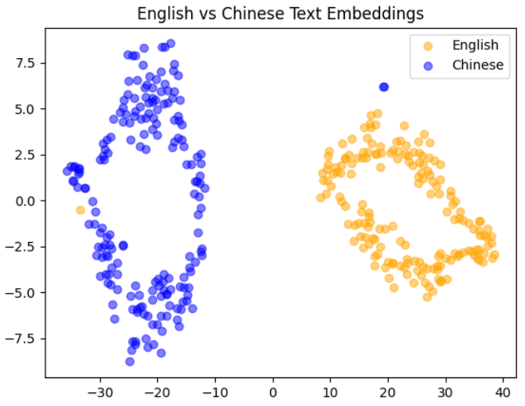
<br>Figure 8. The text embeddings that are produced by the text encoder for English and Chinese text before any training.

<br>
<br>Figure 9. The male and female embeddings output from the audio encoder after it is trained in setting 2 (with GRL for male and female domains). This figure shows that the embeddings of male and female are mixed, which indicates that their domain differences have been mitigated.

<br>
<br>Figure 10. The English and Chinese embeddings output from the audio encoder after it is trained in setting 3 (with GRL for English and Chinese domains). This figure shows that the embeddings of English and Chinese are mixed which indicate that their domain differences has been mitigated.

<br>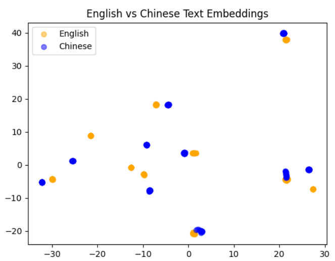
<br>Figure 11. The English and Chinese embeddings output from the text encoder after it is trained in setting 3 (with GRL for English and Chinese domains). This figure shows that the embeddings of English and Chinese are mixed, which indicates that their domain differences have been mitigated.<br>

<br><br>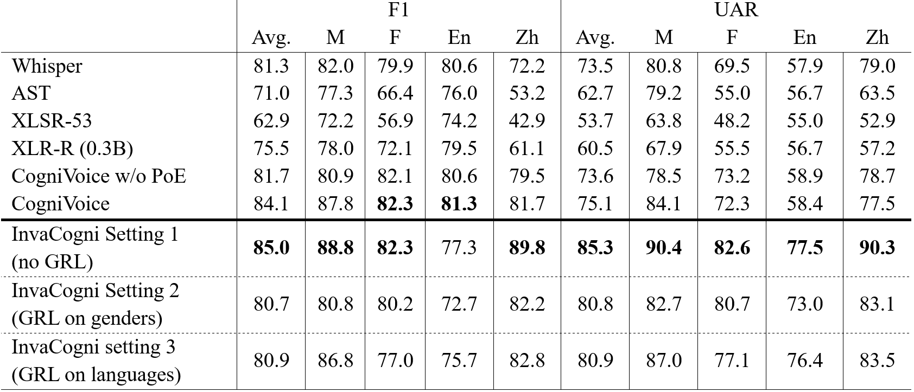
Table 1. The performance of InvaCogni compared to the baseline models reported in [2]. The results are averaged across 10 folds. The highest score in each column is bold.

From Table 1, the InvaCogni model with no GRL has the highest performance in most columns. Most of the models perform better on male than female. InvaCogni in 3 training settings and CogniVoice perform better on Chinese and English in terms of F1 score, and almost all models perform better on Chinese than English in terms of AUR score. When GRL is applied, the overall performance of InvaCogni drops by about 4%, but the performance gap between male and female groups is reduced to only a 2% difference for UAR and a 0.6% difference for F1, and the model’s performance gap between English and Chinese speakers reduces to a 7.1% difference for the UAR score. I believe the reason that applying GRL on language does not work as well as on genders is because the male and female embeddings are more nicely mixed before training, as shown in Figure 6, so it has an easier time making male and female embeddings become domain invariant, while the English and Chinese embeddings are separated before training, as shown in Figure 7 and Figure 8, so it has a harder time reducing the domain differences. Also, I believe the reason that using GRL in settings 2 and 3 makes the performance drop by 4% compared to when not using it is because the audio and text encoders receive the gradients from 2 separate paths for 2 different tasks, which makes the main task (MCI classifying) have a harder time adjusting and adapting to the changes in embeddings from the encoders.

## References
1. A. Radford, J. W. Kim, T. Xu, G. Brockman, C. McLeavey, and I. Sutskever, “Robust speech recognition via large-scale weak supervision,” in ICML. PMLR, 2023
2. Cheng, Jiali, et al. “CogniVoice: Multimodal and multilingual Fusion Networks for mild cognitive impairment assessment from spontaneous speech.” Interspeech 2024, 1 Sept. 2024, pp. 4308–4312, https://doi.org/10.21437/interspeech.2024-2370.
3. Ganin, Yaroslav, and Victor Lempitsky. “Unsupervised Domain Adaptation by Backpropagation.” arXiv.Org, 27 Feb. 2015, arxiv.org/abs/1409.7495. 
4. J. Devlin, M.-W. Chang, K. Lee, and K. Toutanova, “BERT: Pretraining of deep bidirectional transformers for language understanding,” in NAACL, 2019
5. “Mild Cognitive Impairment (MCI).” Mayo Clinic, Mayo Foundation for Medical Education and Research, 24 Oct. 2024, www.mayoclinic.org/diseases-conditions/mild-cognitive-impairment/symptoms-causes/syc-20354578. 
6. “What Is Dementia? Symptoms, Causes & Treatment.” Alzheimer’s Association, www.alz.org/alzheimers-dementia/what-is-dementia. Accessed 30 Oct. 2025. 
7. Zhai, Xiaohua, et al. “Sigmoid Loss for Language Image Pre-Training.” arXiv.Org, 27 Sept. 2023, arxiv.org/abs/2303.15343. 

